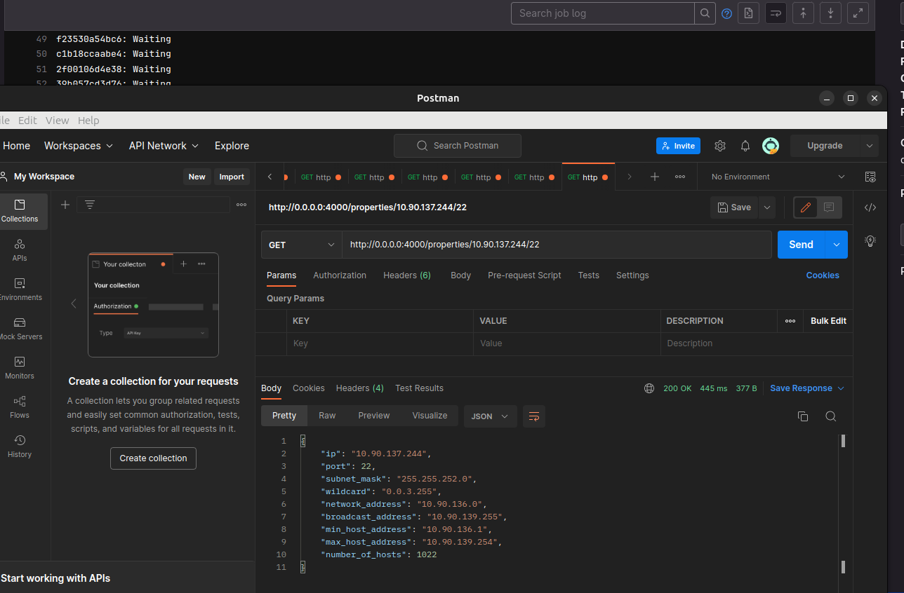

# Network Properties Calculator

## **Developer**
[Paranid5](https://github.com/dinaraparanid)

## **About App**

**Network Properties Calculator** is a simple web server
that provides all properties of a given IP address
in a JSON format.

Additionally, GitLab pipeline and Dockerfile
are configured for user's needs.

### **Preview**

## **Stack**

<ul>
    <li>Scala 3</li>
    <li>Cats Effects</li>
    <li>Http4S</li>
    <li>Circle</li>
    <li>Scala Test</li>
    <li>Docker</li>
    <li>GitLab CI/CD</li>
</ul>

## **System Requirements**
**Java 21** is required to build project

## **License**
*GNU Public License V 3.0*